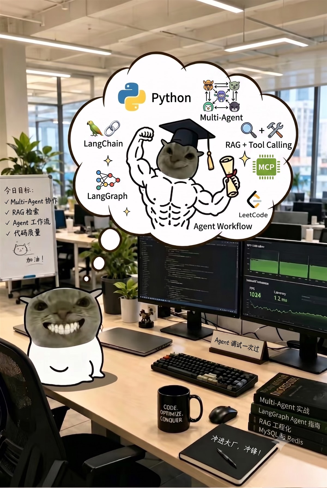

<!-- GitHub Profile README for https://github.com/wang-chao-2025 -->

### 👨‍💻 后端开发工程师 · AI 应用工程方向

  

`🚀 关注后端工程与大模型应用的结合，让 RAG、Agent 和工具调用真正进入业务系统。`

  <picture>
    <source media="(prefers-color-scheme: dark)" srcset="https://raw.githubusercontent.com/wang-chao-2025/wang-chao-2025/output/github-contribution-grid-snake-dark.svg" />
    <source media="(prefers-color-scheme: light)" srcset="https://raw.githubusercontent.com/wang-chao-2025/wang-chao-2025/output/github-contribution-grid-snake.svg" />
    
  </picture>

## 👋 About Me

我是一名 **Java / Python 后端开发者**，熟悉常见业务接口开发、数据访问和缓存设计。目前主要关注 **RAG、Agent、MCP 工具调用和 ,Multi-Agent** 方向的应用开发。

相比单纯接入模型，我更关注完整系统怎么落地：知识如何检索、Agent 如何规划和调用工具、上下文如何保持，以及执行过程怎样做到可观察、可扩展。

---

## 🧰 Core Skills

- ☕ **Java 后端开发**：熟悉 Spring Boot、Spring MVC、MyBatis 和 MyBatis-Plus，能够完成业务接口与数据访问层设计
- 🐍 **Python 应用开发**：使用 FastAPI、Pydantic 构建后端服务与 AI 应用接口，支持结构化输出和 SSE 流式响应
- 🗄️ **数据与缓存**：熟悉 MySQL、Redis，了解缓存设计、分布式锁、缓存一致性和高并发场景下的常见优化方法
- 🤖 **AI 应用开发**：熟悉 LangChain、LangGraph、Spring AI，能够搭建 RAG 问答系统和 Agent 工作流
- 📚 **检索与知识库**：掌握文档切分、向量化、向量存储和相似度检索，熟悉 Milvus 向量数据库
- 🔌 **工具与工程化**：了解 MCP 与 Tool Calling，能够接入外部工具，并使用 Maven、Git、Docker 完成开发与部署

---

## 🔬 Research Focus

- 🧭 **Agent 推理与编排**：ReAct、Plan-Execute-Replan、Supervisor 与多 Agent 协作模式
- 🧠 **上下文与记忆**：多轮会话、历史持久化、长上下文管理和跨会话知识继承
- 🧩 **RAG 与工具协同**：检索增强、MCP、Tool Calling 与任务型 Agent 的组合方式
- 👥 **Multi-Agent 系统**：任务拆分、角色分工、并行执行与协作结果汇总
- 🛡️ **Agent 安全执行**：命令、路径、规则、权限模式与人工确认构成的执行边界
- 🚨 **智能运维 Agent**：日志和监控工具调用、故障排查与结构化诊断输出

  

---

## 🧱 Tech Stack

### ☕ Backend

`Spring MVC` · `MyBatis` · `MyBatis-Plus` · `Pydantic` · `REST API` · `SSE`

### 🗄️ Data & Infrastructure

`缓存设计` · `分布式锁` · `缓存一致性` · `向量检索`

### 🤖 AI & Agent

`RAG` · `Tool Calling` · `Multi-Agent` · `Chat Memory` · `Structured Output` · `Dify`

---

## 🏀 Beyond Code

  

---

### ✨ Thanks for visiting

后端工程打好基础，AI 让系统处理更复杂的任务。

